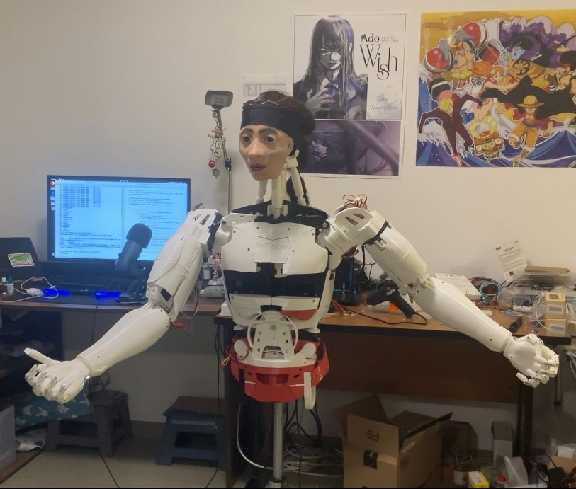
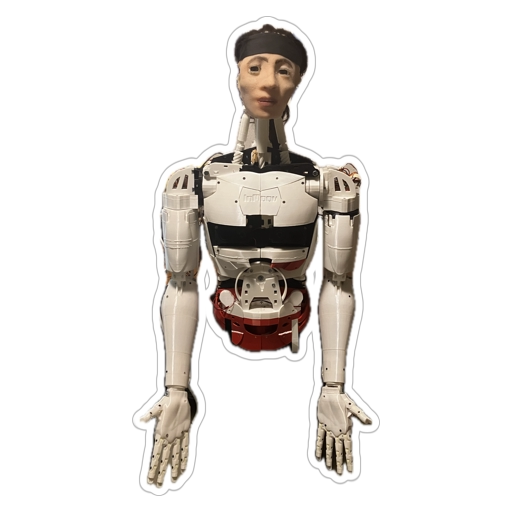
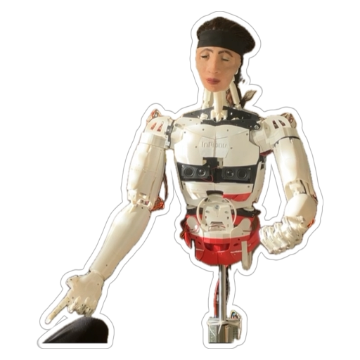
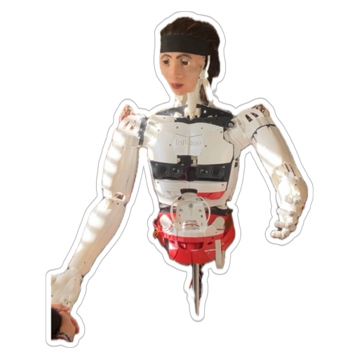

# Akira’s Journey into Expressive Human‑Robot‑AI Mutual Understanding
*Inspired by Hiroshi Ishiguro’s Symbiotic Human‑Robot Interaction Project*

## Table of Contents
- [Project Overview](#project-overview)
- [Who is Akira?](#who-is-akira)
- [Photos](#photos)
- [Acknowledgments](#acknowledgments)

## Project Overview

> _This project is documented on YouTube. Follow along here: <https://www.youtube.com/@maiguek-516>_

**Akira’s Journey** is the practical component of my Bachelor’s thesis exploring how people perceive “being human”. Akira, a humanoid robot, is built almost entirely from open‑source projects, including the **Inmoov project** (body), **Llama 3.2 3B** (language), **F5‑TTS** (voice), **Whisper** (speech‑to‑text), and **BLIP** (image captioning).

The goal was to create a robot that could participate in natural, casual conversations and to study those interactions qualitatively with volunteers.

## Who is Akira?

* **Platform:** NVIDIA Jetson Orin Nano Super (everything runs locally)
* **Skeleton:** Inmoov (3‑D printed)
* **Face:** Hand‑cast silicone mask modelled on my own face + wig
* **Electronics**
  * 2 × Arduino Mega controlling all actuators
  * 42 servomotors (currently 28 in use: 10 per arm, 3 neck, 1 jaw, 4 eyelids)
  * 6 V / 60 A SMPS
  * K80C1 CKOKC wireless mic + Waveshare USB audio adapter
  * 2 × 5 V 8 Ω speakers
  * 10‑port RSHTECH USB 3.2 hub
  * 2 × 4 K 12 MP cameras (OV5693 / IMX258)

## Photos

| | |
|---|---|
| **Winking** |  |
| **Listening mode** |  |
| **Thinking mode** |  |
| **Talking mode** |  |
| **Early stage 1** |  |
| **Early stage 1.1** |  |
| **Audio‑signal visualisation** |  |

## Acknowledgments

- My supervisors and classmates from the AI bachelor’s programme for continuous support and feedback  
- **Hiroshi Ishiguro** for pioneering work on human‑robot symbiosis  
- **Gael Langevin** for the open‑source **Inmoov** design  
- **Meta** for releasing open‑source large‑language models such as **Llama 3.2**  

