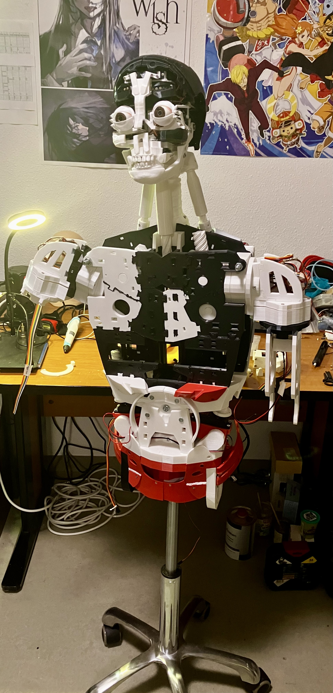

# Akira’s Journey into Expressive Human-Robot-AI Conversations

_A Humanoid Social Robot inspired by Hiroshi Ishiguro’s Symbiotic Human-Robot Interaction Project_

## Table of Contents
- [Project Overview](#project-overview)
- [Features](#features)
- [Current development status](#current-development-status)
- [Research Goals](#research-goals)
- [Photos] (#photos)
- [License](#license)
- [Acknowledgments](#acknowledgements)

## Project Overview

_Note: This project is also being documented in YouTube, please check it out: https://www.youtube.com/@maiguek-516_

**Akira’s Journey** is an ongoing research and development project focused on enhancing human-robot interactions through conversational AI. Akira, a humanoid robot, is built using the open-source Inmoov project design by Gael Langevin and draws inspiration from Hiroshi Ishiguro’s work on symbiotic human-robot interactions.

This project aims to create a robot capable of engaging in natural and expressive conversations to a certain extent. Helping highlight areas for improving the way AI perceives and mimics human social behaviors. Akira is being developed as part of my Bachelor's thesis in Artificial Intelligence, with final experiments focused on what makes robots feel more human-like.

## Features
- **Human-like Conversations**: Leveraging state-of-the-art NLP models to simulate natural conversations.
- **Humanoid Design**: Built using the [Inmoov project](https://inmoov.fr/) design and controlled via servos for facial expressions and body movements. Intended skin will be made out of silicone.
- **Custom Hardware Integration**: Utilizes Arduino Mega boards for main servo control operations, PCA9685 for face servomotor control, Mini Cameras attached to the retina, Custon Power Distribution boards, all powered by a 6V 12Ah battery and commanded via a NUC (Mini PC). If time permits, UGN3503UA Hall effect sensors for feedback mechanisms shall be soon installed. (For more details please refer to the hardware components list below) 
- **AI-Driven Social Interaction**: Experiments will be conducted on enhancing human-robot interactions based on AI-driven conversational techniques.
- **Multilingual Capabilities**: Intended intiial support for conversations in English. Other languages may be considered as the project evolves.

## Current development status

### Hardware and Physical Robot Construction

For 3D printing I have been using an Ender 3 V2, which has required some customary fixings, but makes the job. I have been printing with PLA.

External hardware components needed for Akira:

- PCA9685 (board to control up to 16 servos for the face) x1
- JX PDI-1109MG servos (for the face) x16
- JX PDI-6225MG servos (for the fingers and wrists) x12
- DS5160 servos (for shoulders, stomack and biceps) x12
- DS3235SG270 servos (for neck and jaw) x5
- OV5693/IMX258 mini USB cameras (for the eyes) x2
- 6V 12Ah battery.
- USB port hub.
- NIPOGI NUC - Mini PC
- Wiring and soldering meterials, etc.

At this moment Akira has **successfully assemembled** his:
- Face (_Note: due to a possible problem with the PCA9685, left eye LR sevomotor has burned twice_)
- Neck
- Shoulders
- Torso
- Upper Stomach
- Back
- Power Distribution
- Stand - Low Stomach _(Just assembled)_

Out of these, the next are **totally functional** (I can control successfully all servomotors):
- Face
- Neck
- Left Shoulder

#### Missing parts:

To be **assembled**:
- Biceps _(Being assembled currently)_
- Hands _(Being assembled currently)_
- Chest
- Skin

Already **fully printed**:
- Biceps
- Hands
- Low Stomach

To be **printed**:
- Chest
- Forearm _(Currently printing)_
- Wrist _(Currently printing)_

Other hardware such as microphones and speakers are yet to be assembled.

### Software and Conversational models

I have been working using a custom conda environment with Python 3.11.10, and Arduino IDE for servo communication and testing. So far I have succeeded and have tested all current assembled servomotors using a custom GUI with Tkinter. ChatGPT helped me on developing quickly this GUI for the servo testing, which can be accessed in the file _ServoTesting.py_.

Furthermore, I have now successfully came up with an initial version for the language generation part. By downloading free open-source **Llama3.2-3B** quantized models from Meta, I have been able to come up with an initial version that can generate Akira's text responses in accordance to a previous flow of conversation.

Further testing and updates to the text conversational system are yet to be prepared, I am still testing this model on this mini PC without a GPU, and depending on how long or extensive the requests are, the PC is behaving differently and even turning itself off if the worload is too much. Therefore it is my task now to try to optimize this and see how to assemble a complete system that can run smoothly and produce good results, as many other tasks will run in parallel to the conversation (i.e. gesture and movement generation, and visual analyzis).

My **current developing tasks** include preparing the following models:
- _Language Model (Done! -> Optimize it and set conversational system)_
- Vision Model
- Listening Model
- Servo Control Model

## Research Goals

This project will be used to conduct several experiments:

- Investigating the role of simple facial expressions and movement in human-robot interaction.
- Exploring the effectiveness of the various presented models in producing lifelike conversations.
- Measuring how well humans respond to Akira's social skills. 
- Analyze qualitatively how interactans respond and reflect on Akira's approach to talk to new people, with their own ways of approaching people in a similar setting.

_Note: Akira will be far away of being perfect either by its physical structure or its conversational skills._

These experiments will form the core of my thesis for my Bachelor's degree in Artificial Intelligence, with a focus on robotics and human-robot interaction under the guidance of my supervisors’ research principles.

## Photos

## License

This project is licensed under the MIT License.

## Acknowledgments
- My supervisors and colleagues from the AI Bachelor’s program for their ongoing support and feedback.
- Hiroshi Ishiguro for inspiring the project with his research on human-robot symbiosis.
- Gael Langevin for the open-source Inmoov design.
- Meta for providing open-source Large Language Models like Llama3.2
    
